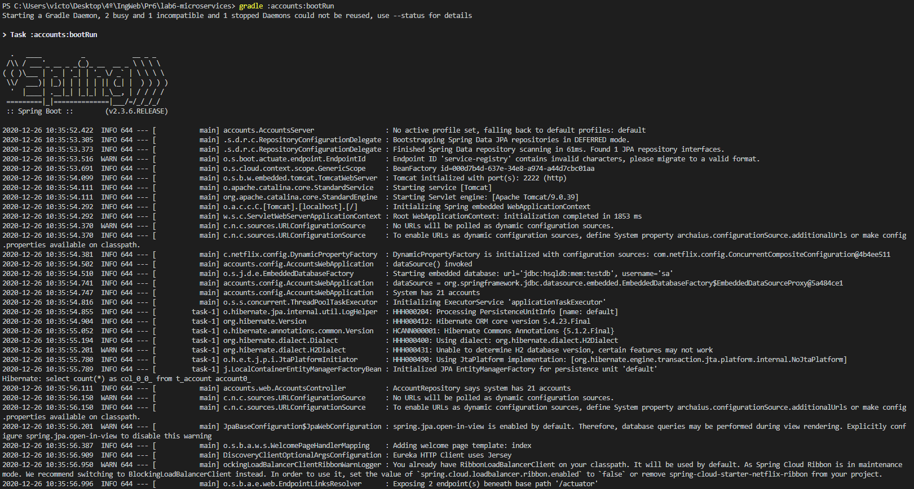

Para empezar la práctica, hay que inicializar el microservicio de web mediante el comando **gradle :web:bootRun**

Se puede observar como se ejecuta correctamente y el tomcat usa el puerto 3333 (al inicio del log)

Después se inicializa account en una nueva terminal mediante **gradle :account:bootRun**, la cual se puede ver como se inicializa en el puerto 2222, tal y como se especifica en 
application.yml

Una vez inicialziado este microservicio, se inicializa en una tercera terminal el acceso a registration mediante **gradle :registration:bootRun** en el puerto 1111

Con todo esto, si accedemos a la página de registration **localhost:1111** aparecerá un dashboard como este:

Si se observa la parte de abajo, en las replicas, se pueden ver los dos procesos accounts y web inicializados en los dos primeros pasos

Vamos a probar a añadir una nueva account. Para ello se modifica el fichero **application.yml** y se cambia el puerto de ejecución (para no causar problemas con la anterior ejecución) a 4444 en este caso. Se inicia otra instancia de accounts con el comando **gradle :account:bootRun**

Una vez iniciado el otro servicio, volvemos al dashboard **localhost:1111** y en la parte de replicas, se puede ver el nuevo microservicio que se ha añadido:

Con respecto a la pregunta de que pasa si se elimina uno de los procesos account, se ha probado a hacer **Ctrl + C** en la primera terminar el puerto 2222. Si se vuelve a entrar al dashboard te salta una advertencia de que eureka puede estar reclamando instancias incorrectamente debido al nuevo servicio caido, ya que ha disminuido el número total de procesos activos encontrados. De hecho, en la parte de accounts-service ya solo aparece el proceso correspondiente a 4444, desapareciendo el otro que se ha cerrado.